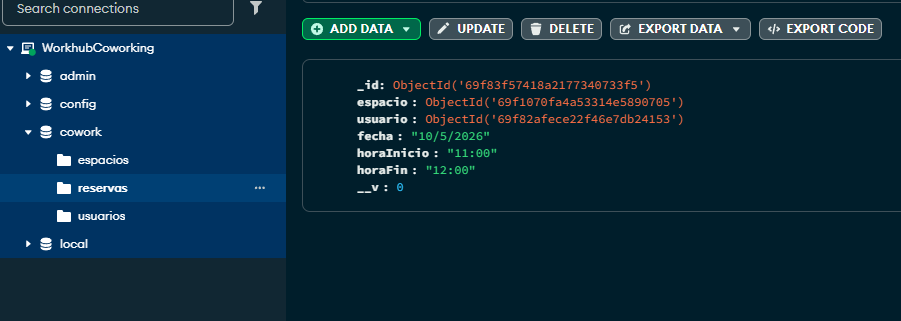
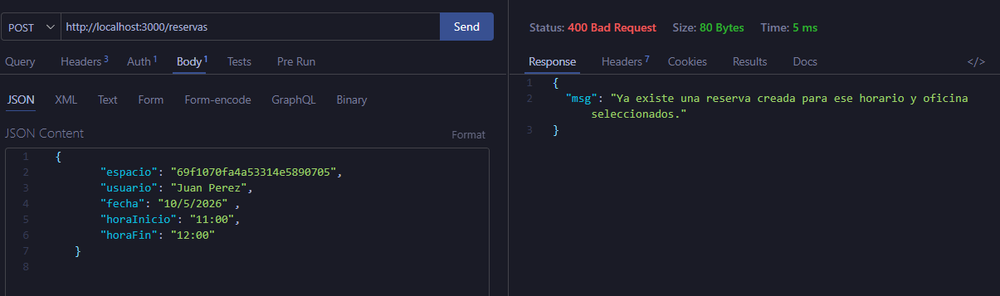

# 🏢 Sistema de Gestión de Espacios y Reservas (V2 - MongoDB local)

API REST construida con **Node.js** y **Express**, diseñada para la gestión de espacios físicos y la reserva de los mismos. Esta implementación utiliza **MongoDB** como base de datos persistente y cuenta con un sistema robusto de autenticación y validación.

---

## 🚀 Tecnologías y Herramientas

*   **Backend:** Node.js, Express.
*   **Base de Datos:** MongoDB con **Mongoose** como ODM.
*   **Seguridad:** 
    *   **Bcryptjs:** Para el cifrado de contraseñas.
    *   **JSON Web Tokens (JWT):** Para la gestión de sesiones y autenticación.
*   **Variables de Entorno:** Gestionadas mediante `dotenv`.
*   **Pruebas:** Thunder Client / Postman.

---

## ⚙️ Configuración e Instalación

1. **Clonar el repositorio e instalar dependencias:**
   ```bash
   npm install
   ```

2. **Configurar variables de entorno:**
   Crea un archivo `.env` en la raíz del proyecto y añade:
   ```env
   PORT=3000
   MONGO_URI=tu_cadena_de_conexion_mongodb
   SECRET_KEY=tu_clave_secreta_para_jwt
   ```

3. **Ejecutar el servidor:**
   ```bash
   # Modo desarrollo (con nodemon)
   npm run dev
   ```

---

## 🛠️ Estructura de la API

### Autenticación (Usuarios)
| Método | Endpoint | Descripción |
| :--- | :--- | :--- |
| `POST` |  `/users/registro` | Crea un nuevo usuario y cifra su contraseña. |
| `POST` |  `/users/login` | Inicio de sesión. | `{ "email", "password" }` -> Retorna `token` || Valida credenciales y devuelve un token JWT. |
| `GET` | `/users` | Listar usuarios.  **Requiere Token Admin* |
| `PUT` | `/users/:id` | Editar perfil. | `{ "nombre", "email", "password" }` |
| `DELETE` | `/users/:id` | Borrar cuenta.  **Requiere Token Admin* |

### Gestión de Espacios
| Método | Endpoint | Descripción |
| :--- | :--- | :--- |
| `GET` | `/espacios` | Obtiene la lista de todos los espacios en la DB. |
| `POST` | `/espacios` | Registra un nuevo espacio de trabajo. **Requiere Token Admin*|
| `PUT` | `/espacios/:id` | Editar espacio. **Requiere Token Admin*| Envía solo los campos a modificar.  |
| `DELETE` | `/espacios/:id` | Eliminar espacio. **Requiere Token Admin*| Elimina el registro por su ID de MongoDB. |
### Reservas
| Método | Endpoint | Descripción |
| :--- | :--- | :--- |
| `GET` | `/reservas` | Lista todas las reservas realizadas. |
| `POST` | `/reservas` | Crea una reserva (Requiere validación de disponibilidad). |
| `PUT` | `/reservas/:id` | Modifica una reserva existente (cambio de fecha u hora). |
| `DELETE` | `/reservas/:id` | Cancela o elimina una reserva por su ID. |

---

## 🛡️ Características de Seguridad y Validación

1.  **Validación de Reservas:** El sistema cuenta con un middleware `validateReserva.js` que:
    *   Verifica que todos los campos obligatorios estén presentes.
    *   Valida la existencia del `espacioId` en la base de datos antes de proceder.
    *   Evita conflictos de horarios.

2.  **Cifrado de Contraseñas:** En el controlador de usuarios, las contraseñas nunca se guardan en texto plano; se utiliza un *hash* seguro.

3.  **Autorización (JWT):** Los endpoints sensibles están protegidos por un middleware de autenticación que verifica la validez del token enviado en las cabeceras.

---

## 🧪 Guía de Pruebas (Thunder Client)

1. Abrir el proyecto en **Visual Studio Code**.
2. Instalar las dependencias con:

```bash
npm install
```

3. Levantar el servidor con:

```bash
npm run dev
```

4. Abrir la extensión **Thunder Client** en VS Code.
5. Crear una nueva request.
6. Seleccionar el método HTTP correspondiente.
7. Escribir la URL completa, por ejemplo:

```txt
http://localhost:3000/espacios 
```
---
### Registro de Usuario

* **POST**
*   **URL:** `http://localhost:3000/users/registro`
*   **Cuerpo (JSON):**
    ```json
    {
     "nombre": "Juan Pérez",
     "email": "juan@example.com",
     "password": "miPasswordSeguro",
     "rol": "usuario"
    }


### Resultado esperado

- **Status:** `201 Created`
- **Respuesta:** arreglo JSON con el mensaje "Creado correctamente" junto al id del usuario creado.
---

### Login
* **POST**
*   **URL:** `http://localhost:3000/users/login`


### Resultado esperado

- **Status:** `200 OK`
- **Respuesta:** Recibirás un `token` junto al mensaje "Login Correcto". Debes usar este token en las cabeceras `Authorization: Bearer <token>` para las rutas protegidas.

---
### Crear Reserva
* **POST**
*   **URL:** `http://localhost:3000/reservas`
*   **Validación Automática:** Si intentas reservar un espacio inexistente o dejas campos vacíos, la API responderá con `400 Bad Request` o `404 Not Found ("Todos los campos son obligatorios")` según corresponda.





### Resultado esperado

- **Status:** `201 Created`
- **Respuesta:** objeto JSON con los datos de la reserva creada

---
### Actualizar Reserva
* **PUT**
*   **URL:** `http://localhost:3000/reservas/id`


### Resultado esperado

- **Status:** `200 OK`
- **Respuesta:** mensaje: "Reserva actualizada" junto a objeto JSON con los datos de la reserva actualizada
---
### Borrar Reserva
* **DELETE**
*   **URL:** `http://localhost:3000/reservas/id`


- **Status:** `200 OK`
- **Respuesta:** mensaje: "Reserva Eliminada Correctamente" junto con la eliminación del objeto JSON de la reserva

## 📂 Estructura del Proyecto

```text
BackEnd/
├── src/
│   ├── controllers/    # Lógica de negocio (usuarios.controllers.js)
│   ├── database/       # Conexión a MongoDB (mongoose.js)
│   ├── middlewares/    # Validaciones y Auth (validateReserva.js, errorHandler.js)
│   ├── models/         # Esquemas de Mongoose (espacios, usuarios, reservas)
│   ├── routes/         # Definición de endpoints (users.routes, reservas.routes)
│   └── app.js          # Configuración principal de Express
├── .env                # Variables de entorno (no incluido en git)
└── package.json        # Dependencias y scripts
