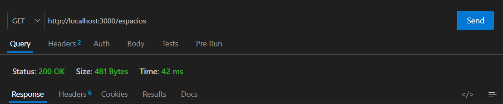
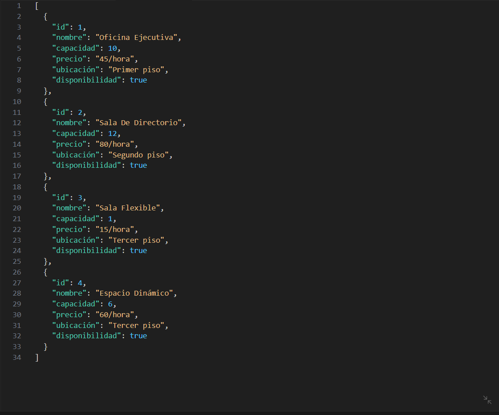
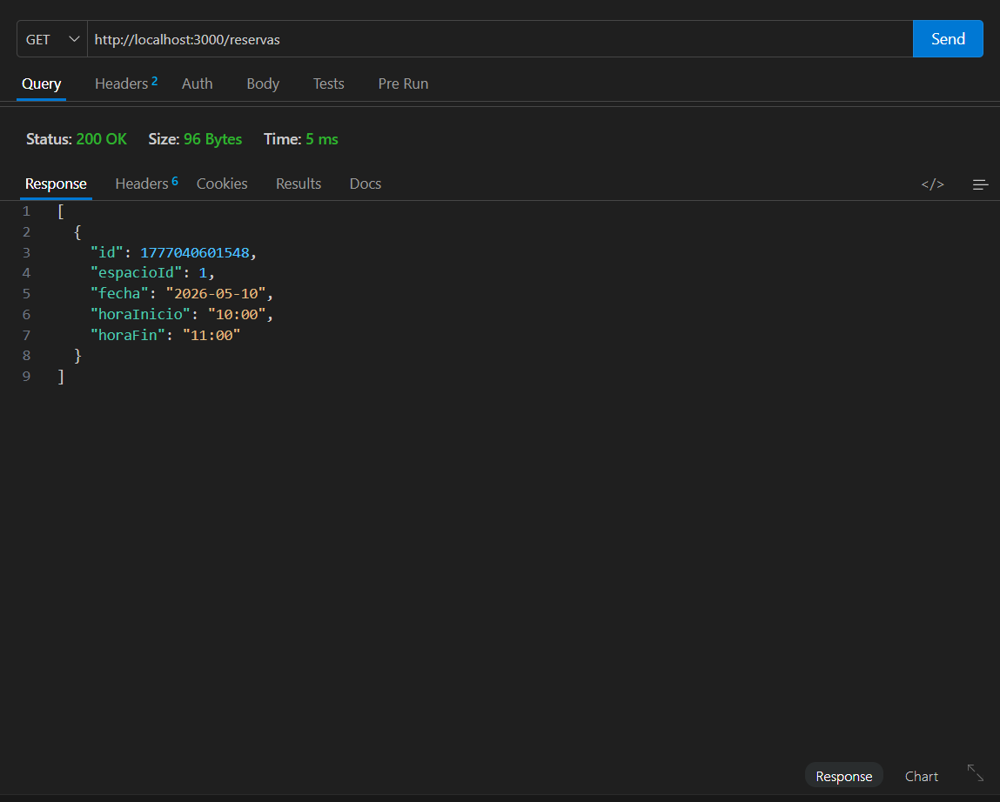
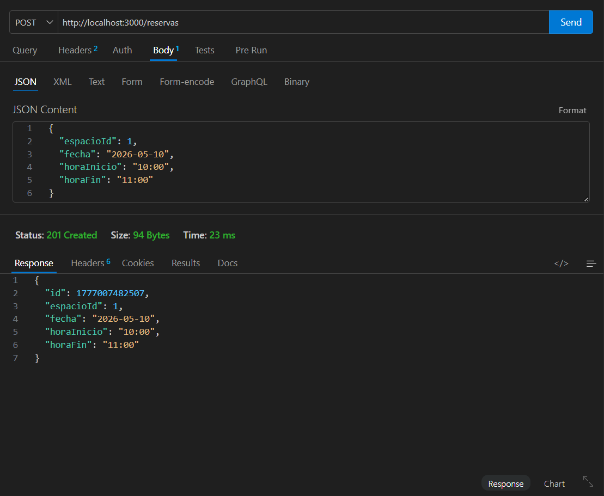
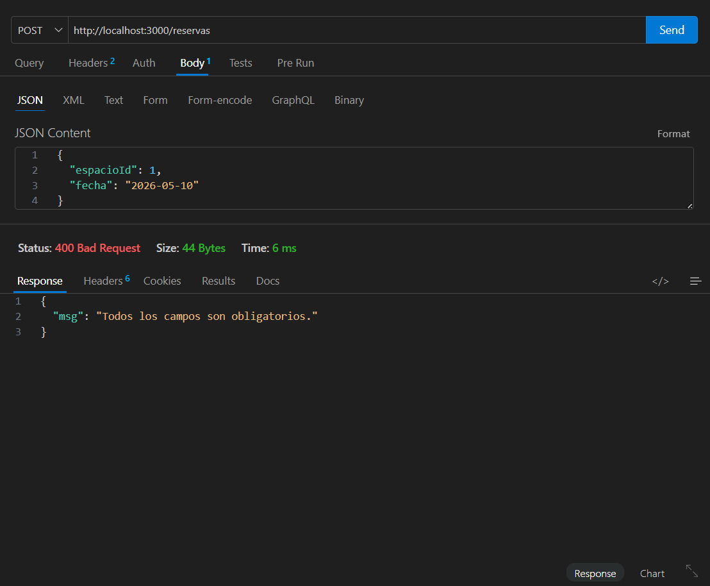
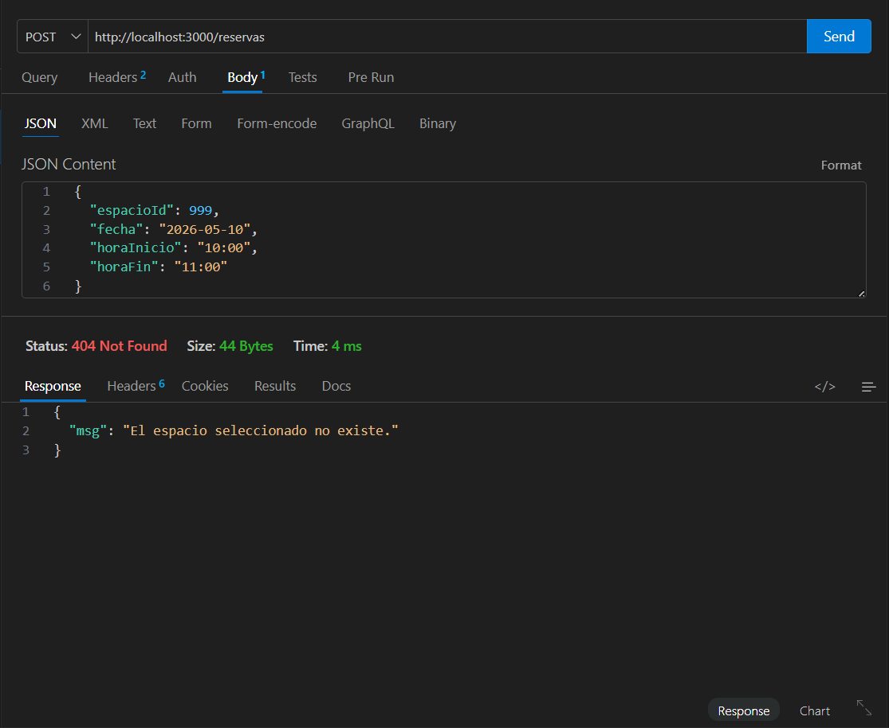
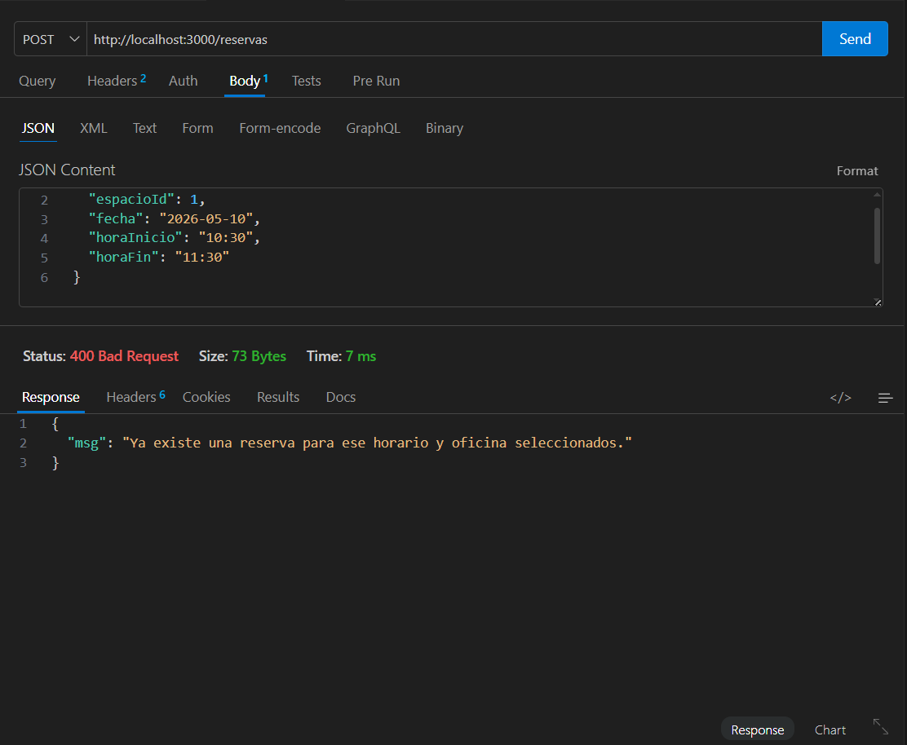

# 🏢 Sistema de Gestión de Espacios y Reservas

API REST construida con **Node.js** y **Express**. Este sistema permite consultar espacios disponibles y realizar reservas utilizando archivos JSON como almacenamiento simulado.

---

## 🛠️ Tecnologías

- **Node.js**
- **Express**
- **Nodemon**
- **JSON** como almacenamiento simulado

---

## ⚙️ Instalación y ejecución del proyecto

Para ejecutar el proyecto localmente, primero instalar las dependencias:

```bash
npm install
```

Luego levantar el servidor en modo desarrollo:

```bash
npm run dev
```

Si todo está correcto, la terminal debería mostrar el mensaje:

```bash
Servidor corriendo en http://localhost:3000
```

---

## 📋 Documentación de Endpoints


| Método | Endpoint | Descripción | Estado esperado |
| :--- | :--- | :--- | :--- |
| `GET` | `/espacios` | Obtiene la lista completa de espacios disponibles. | `200 OK` |
| `GET` | `/reservas` | Obtiene la lista completa de reservas realizadas. | `200 OK` |
| `POST` | `/reservas` | Crea una nueva reserva. | `201 Created` |


---

## 🧪 Pruebas con Thunder Client

Thunder Client es una extensión de Visual Studio Code que permite probar endpoints de una API sin usar el navegador. En este proyecto se utiliza para verificar que las rutas del backend respondan correctamente.

### Pasos generales para realizar las pruebas

1. Abrir el proyecto en **Visual Studio Code**.
2. Instalar las dependencias con:

```bash
npm install
```

3. Levantar el servidor con:

```bash
npm run dev
```

4. Abrir la extensión **Thunder Client** en VS Code.
5. Crear una nueva request.
6. Seleccionar el método HTTP correspondiente: `GET` o `POST`.
7. Escribir la URL completa, por ejemplo:

```txt
http://localhost:3000/espacios
```

8. En las pruebas `POST`, seleccionar la pestaña **Body**, elegir formato **JSON** y escribir el cuerpo de la solicitud.
9. Presionar **Send**.
10. Revisar que el **status code** y la **respuesta JSON** coincidan con lo esperado.
11. Tomar captura de pantalla para documentar la prueba en el README.

---

## 📌 Tabla resumen de pruebas

| N° | Método | URL | Caso probado | Status esperado |
| :--- | :--- | :--- | :--- | :--- | 
| 1 | `GET` | `http://localhost:3000/espacios` | Listar espacios disponibles | `200 OK` | 
| 2 | `GET` | `http://localhost:3000/reservas` | Listar reservas con datos registrados | `200 OK` |
| 3 | `POST` | `http://localhost:3000/reservas` | Crear reserva exitosa | `201 Created` | 
| 4 | `POST` | `http://localhost:3000/reservas` | Validar campos faltantes | `400 Bad Request` |
| 5 | `POST` | `http://localhost:3000/reservas` | Validar espacio inexistente | `404 Not Found` | 
| 6 | `POST` | `http://localhost:3000/reservas` | Validar conflicto de horario | `400 Bad Request` | 

---

## 1. Prueba GET /espacios

### Objetivo

Comprobar que la API devuelve correctamente la lista de espacios disponibles.

### Configuración en Thunder Client

- **Método:** `GET`
- **URL:**

```txt
http://localhost:3000/espacios
```

### Resultado esperado

- **Status:** `200 OK`
- **Respuesta:** arreglo JSON con los espacios disponibles.

### Captura




---

## 2. Prueba GET /reservas (con datos)

### Objetivo

Comprobar que la API devuelve correctamente las reservas registradas en el sistema después de haber creado al menos una reserva.

### Configuración en Thunder Client

- **Método:** `GET`
- **URL:**

```txt
http://localhost:3000/reservas
```

### Resultado esperado

- **Status:** `200 OK`
- **Respuesta:** arreglo JSON con las reservas almacenadas, incluyendo propiedades como `id`, `espacioId`, `fecha`, `horaInicio` y `horaFin`.

### Captura



---

## 3. Prueba POST /reservas - reserva exitosa

### Objetivo

Comprobar que la API permite crear una reserva cuando todos los datos son válidos.

### Configuración en Thunder Client

- **Método:** `POST`
- **URL:**

```txt
http://localhost:3000/reservas
```

- **Body JSON:**

```json
{
  "espacioId": 1,
  "fecha": "2026-05-10",
  "horaInicio": "10:00",
  "horaFin": "11:00"
}
```

### Resultado esperado

- **Status:** `201 Created`
- **Respuesta:** objeto JSON con la reserva creada y un `id` generado automáticamente.

### Captura



---

## 4. Prueba POST /reservas - campos faltantes

### Objetivo

Comprobar que la API rechaza una reserva cuando faltan campos obligatorios.

### Configuración en Thunder Client

- **Método:** `POST`
- **URL:**

```txt
http://localhost:3000/reservas
```

- **Body JSON:**

```json
{
  "espacioId": 1,
  "fecha": "2026-05-10"
}
```

### Resultado esperado

- **Status:** `400 Bad Request`
- **Respuesta esperada:**

```json
{
  "msg": "Todos los campos son obligatorios."
}
```

### Captura



---

## 5. Prueba POST /reservas - espacio inexistente

### Objetivo

Comprobar que la API rechaza una reserva cuando el `espacioId` no existe en la lista de espacios disponibles.

### Configuración en Thunder Client

- **Método:** `POST`
- **URL:**

```txt
http://localhost:3000/reservas
```

- **Body JSON:**

```json
{
  "espacioId": 999,
  "fecha": "2026-05-10",
  "horaInicio": "10:00",
  "horaFin": "11:00"
}
```

### Resultado esperado

- **Status:** `404 Not Found`
- **Respuesta esperada:**

```json
{
  "msg": "El espacio seleccionado no existe."
}
```

### Captura



---

## 6. Prueba POST /reservas - conflicto de horario

### Objetivo

Comprobar que la API rechaza una reserva cuando ya existe otra reserva para el mismo espacio, fecha y horario cruzado.

### Paso previo

Antes de ejecutar esta prueba, primero se debe crear una reserva válida, por ejemplo:

```json
{
  "espacioId": 1,
  "fecha": "2026-05-10",
  "horaInicio": "10:00",
  "horaFin": "11:00"
}
```

Luego se intenta crear una segunda reserva con horario cruzado.

### Configuración en Thunder Client

- **Método:** `POST`
- **URL:**

```txt
http://localhost:3000/reservas
```

- **Body JSON:**

```json
{
  "espacioId": 1,
  "fecha": "2026-05-10",
  "horaInicio": "10:30",
  "horaFin": "11:30"
}
```

### Resultado esperado

- **Status:** `400 Bad Request`
- **Respuesta esperada:**

```json
{
  "msg": "Ya existe una reserva para ese horario y oficina seleccionados."
}
```

### Captura



---
